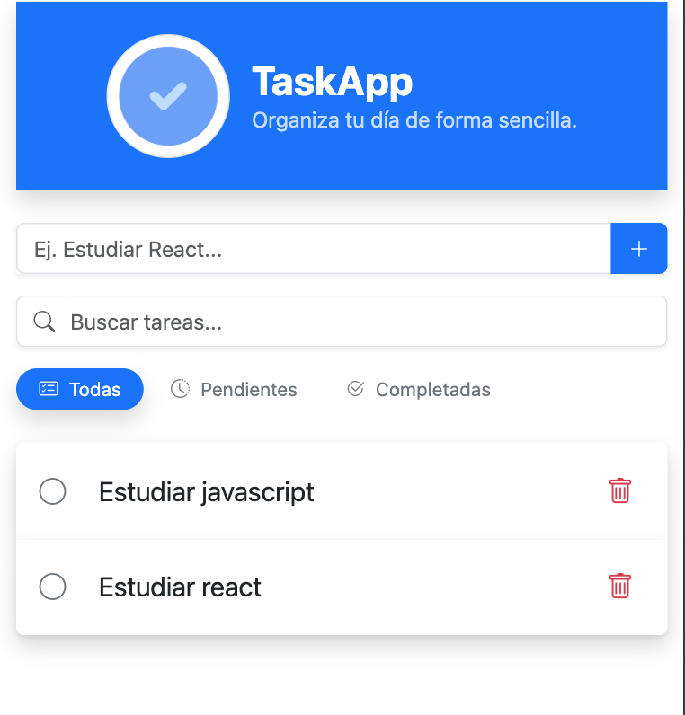
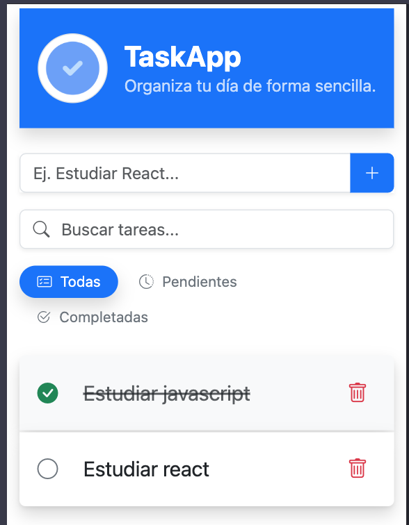
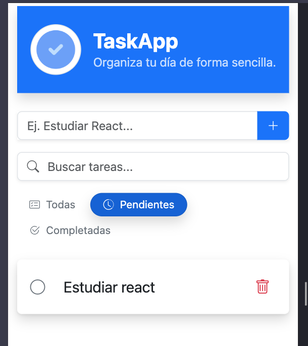
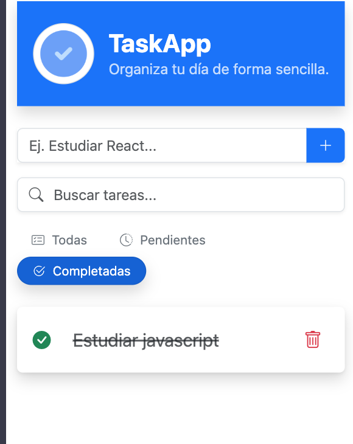
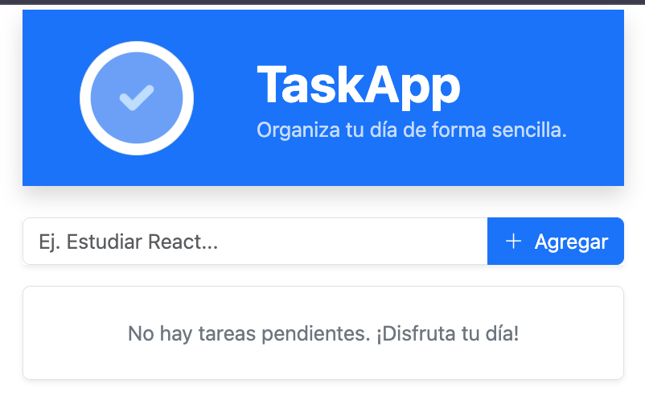
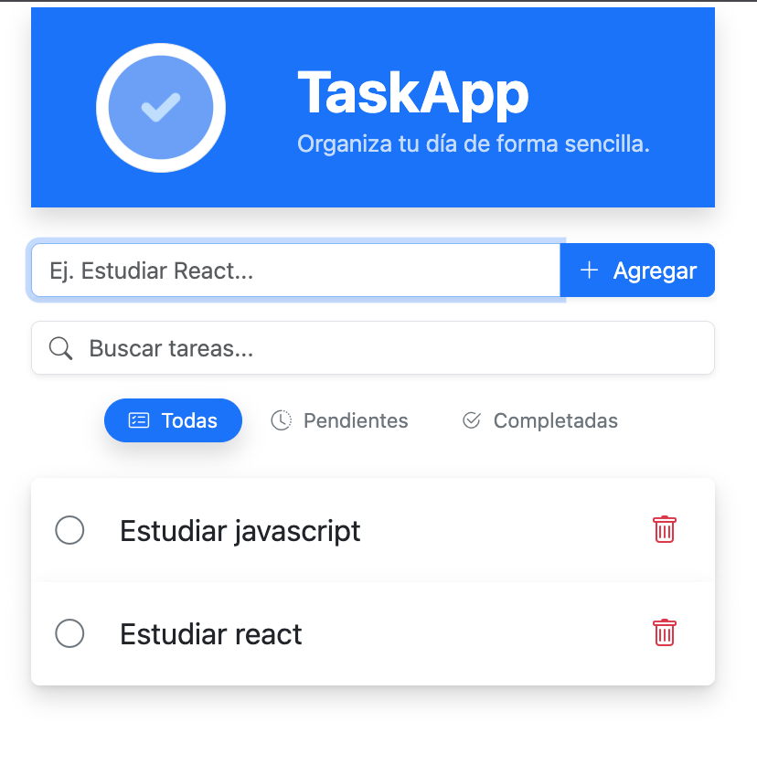

# 📝 Task App (React + Vite)

Una aplicación de gestión de tareas sencilla pero escalable, desarrollada con React y Vite.
Este proyecto forma parte de un reto práctico centrado en la creación de una lista de tareas clara, funcional y fácil de usar.

---

## 🎯 Objetivo

Construir una aplicación web que permite a los usuarios:

- Agregar nuevas tareas
- Marcar tareas como completadas
- Eliminar tareas
- Diferenciación clara de tareas pendientes y completadas

---

## 🚀 Stack Tecnológico

- ⚛️ React (Componentes funcionales + hooks)
- ⚡ Vite
- 🎨 CSS (estilo personalizado)

---

## 📦 Features

### ✅ Funcionalidades Implementadas

- **Gestión Avanzada de Tareas:** Crear, marcar y eliminar con feedback visual inmediato.
- **Búsqueda y Filtrado:** Localización instantánea de tareas mediante buscador y filtros por estado de completado.
- **Persistencia con LocalStorage:** Sincronización automática de datos para evitar la pérdida de información al refrescar.
- **Estado Global (Context API):** Implementación de un `TaskProvider` para evitar el _prop drilling_ y facilitar la escalabilidad.

### 💡 Experiencia de Usuario (UX/UI)

- **Micro-interacciones:** Animaciones "pop" al completar y un sistema de "smooth-exit" al eliminar tareas.
- **Feedback de Estados Vacíos:** Mensajes personalizados y motivadores cuando no hay tareas o filtros aplicados.
- **Diseño Mobile-First:** Experiencia optimizada para móviles con media queries

### 🧠 Estructura de los datos

Cada tarea se representa como un objeto:

```js
{
  id: number,
  text: string,
  completed: boolean
}
```

---

## 🗂️ Estructura del Proyecto

```bash
src/
│
├── components/          # componentes reutilizables
│   ├── TaskList.jsx
│   ├── TaskItem.jsx
│   └── TaskInput.jsx
├── context/             # contexto
│   ├── TaskContext.jsx
│   └── useTasksContext.js
├── hooks/
│   └── useTasks.js
├── utils/               #  funciones de ayuda
├── styles/              #  estilos globales
├── assets/              #  carpeta de multimedia
├── App.jsx              #  logica principal de la app
└── main.jsx             #  renderizado inicial y provider
```

---

## 🛠️ Instalación y configuración

1. Clona el repositorio:

```bash
git clone https://github.com/ali-zunega/Task-App.git
```

2. Navega a la carpeta del proyecto:

```bash
cd Task-App
```

3. Instala dependencias:

```bash
npm install
```

4. Ejecuta el servidor de desarrollo:

```bash
npm run dev
```

---

## 🧪 Próximos Pasos (Scalability)

- **Categorización:** Agregar etiquetas o prioridades a las tareas (Alta, Media, Baja).
- **Modo Oscuro:** Implementar un switch de tema (Light/Dark mode) usando variables CSS.
- **Testing:** Implementación de pruebas unitarias y de integración con _Vitest_ y _React Testing Library_.

---

## 📅 Plan de desarrollo

- **Day 1:** Configuración del proyecto + funcionalidad para agregar tareas
- **Days 2-3:** Implementar la función de eliminar y alternar la finalización
- **Days 4-5:** Mejoras de la UX/UI y pruebas básicas

---

## 📸 Screenshots

### Vista Mobile






### Vista Desktop




---

## 🎥 Demo en Vivo


> **Nota:** Se puede observar la fluidez de las animaciones al completar y eliminar tareas.

---

## 🤝 Autor

[Alicia Zuñega](https://github.com/ali-zunega)
Frontend Developer

---

## 📄 Licencia

This project is open-source and available under the [MIT License](./LICENSE).
