# 📝 Task App (React + Vite)

Una aplicación de gestión de tareas sencilla pero escalable, desarrollada con React y Vite.
Este proyecto forma parte de un reto práctico centrado en la creación de una lista de tareas clara, funcional y fácil de usar.

---

## 🎯 Objetivo

Construir una aplicación web que permite a los usuarios:

- Agregar nuevas tareas
- Marcar tareas como completadas
- Eliminar tareas
- Diferenciación clara de tareas pendientes y completadas

---

## 🚀 Stack Tecnológico

- ⚛️ React (Componentes funcionales + hooks)
- ⚡ Vite
- 🎨 CSS y Bootstrap

---

## 📦 Features

### ✅ Funcionalidades Implementadas

- **Gestión Avanzada de Tareas:** Crear, marcar y eliminar con feedback visual inmediato.
- **Búsqueda y Filtrado:** Localización instantánea de tareas mediante buscador y filtros por estado de completado.
- **Persistencia con LocalStorage:** Sincronización automática de datos para evitar la pérdida de información al refrescar.
- **Sistema de Prioridades:** Cada tarea puede clasificarse como Alta, Media o Baja con badges de colores diferenciados (rojo, amarillo, verde).
- **Estado Global (Context API):** Implementación de un `TaskProvider` para evitar el _prop drilling_ y facilitar la escalabilidad.
- **Testing:** Pruebas unitarias y de integración con _Vitest_ y _React Testing Library_

### 💡 Experiencia de Usuario (UX/UI)

- **Micro-interacciones:** Animaciones "pop" al completar y un sistema de "smooth-exit" al eliminar tareas.
- **Feedback de Estados Vacíos:** Mensajes personalizados y motivadores cuando no hay tareas o filtros aplicados.
- **Diseño Mobile-First:** Experiencia optimizada para móviles con media queries.
- **Modo Oscuro:** Switch de tema integrado para una visualización cómoda en cualquier entorno, persistido mediante LocalStorage.

### 🧠 Estructura de los datos

Cada tarea se representa como un objeto:

```js
{
  id: string,
  text: string,
  completed: boolean,
  priority: "high" | "medium" | "low"
}
```

---

## 🗂️ Estructura del Proyecto

```bash
src/
│
├── components/          # componentes reutilizables
│   ├── TaskList.jsx
│   ├── TaskItem.jsx
│   ├── TaskInput.jsx
│   └── TaskControls.jsx
├── context/             # contexto
│   ├── TaskContext.jsx
│   └── useTaskContext.js
│   ├── ThemeContext.jsx
│   └── useThemeContext.js
├── hooks/
│   └── useTasks.js
├── utils/               # funciones de ayuda
│   └── formatText.js
├── styles/              # estilos globales
├── assets/              # carpeta de multimedia
├── App.jsx              # lógica principal de la app
└── main.jsx             # renderizado inicial y provider
│
__test__/                # tests unitarios y de integración
  ├── formatText.test.js
  ├── useTasks.test.jsx
  ├── useTaskContext.test.js
  ├── useThemeContext.test.js
  ├── TaskInput.test.jsx
  ├── TaskItem.test.jsx
  ├── TaskList.test.jsx
  └── TaskControls.test.jsx

```

---

## 🛠️ Instalación y configuración

1. Clona el repositorio:

```bash
git clone https://github.com/ali-zunega/Task-App.git
```

2. Navega a la carpeta del proyecto:

```bash
cd Task-App
```

3. Instala dependencias:

```bash
npm install
```

4. Ejecuta el servidor de desarrollo:

```bash
npm run dev
```

---

## 🧪 Testing

Los tests utilizan **Vitest** y **React Testing Library**.

### Ejecutar tests

```bash
npm test              # modo watch (recomendado en desarrollo)
npm run test:ui       # interfaz visual en el navegador
npm run test:coverage # reporte de cobertura de código
```

### Archivos de test

Los tests se encuentran en la carpeta `__test__/`:

- `formatText.test.js` - Tests unitarios de funciones utilitarias
- `useTasks.test.jsx` - Tests unitarios del hook useTasks
- `TaskInput.test.jsx` - Tests de integración del componente TaskInput
- `TaskItem.test.jsx` - Tests de integración del componente TaskItem


###  Resultados de los Tests

Se han implementado pruebas unitarias y de integración para asegurar la estabilidad de las funcionalidades.

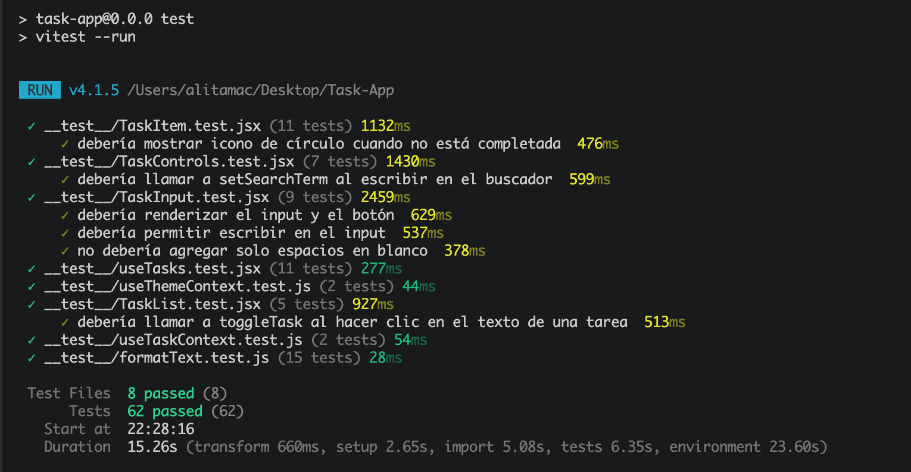

---

## 🧪 Próximos Pasos (Scalability)

- **Editar tareas:** Permitir a los usuarios editar las tareas luego de crearlas.
- **Categorías:** Permitir a los usuarios crear etiquetas personalizadas.
- **Notificaciones:** Avisos visuales cuando se acerca la fecha límite de una tarea.

---

## 📅 Plan de desarrollo

- **Day 1:** Configuración del proyecto + funcionalidad para agregar tareas
- **Days 2-3:** Implementar la función de eliminar y alternar la finalización
- **Days 4-5:** Mejoras de la UX/UI y pruebas básicas

---

## 📸 Screenshots

### Vista Mobile

<div>
  <h4>Light Mode</h4>
  <div>
    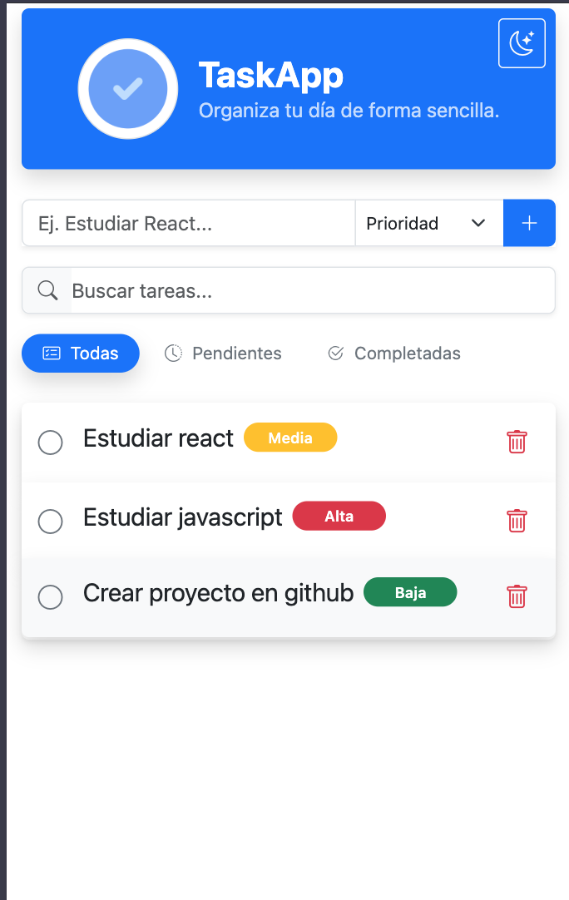 
    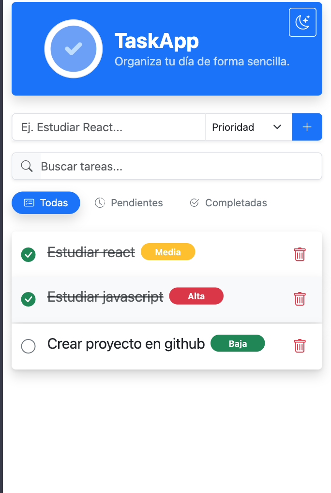
  </div>
  <div>
    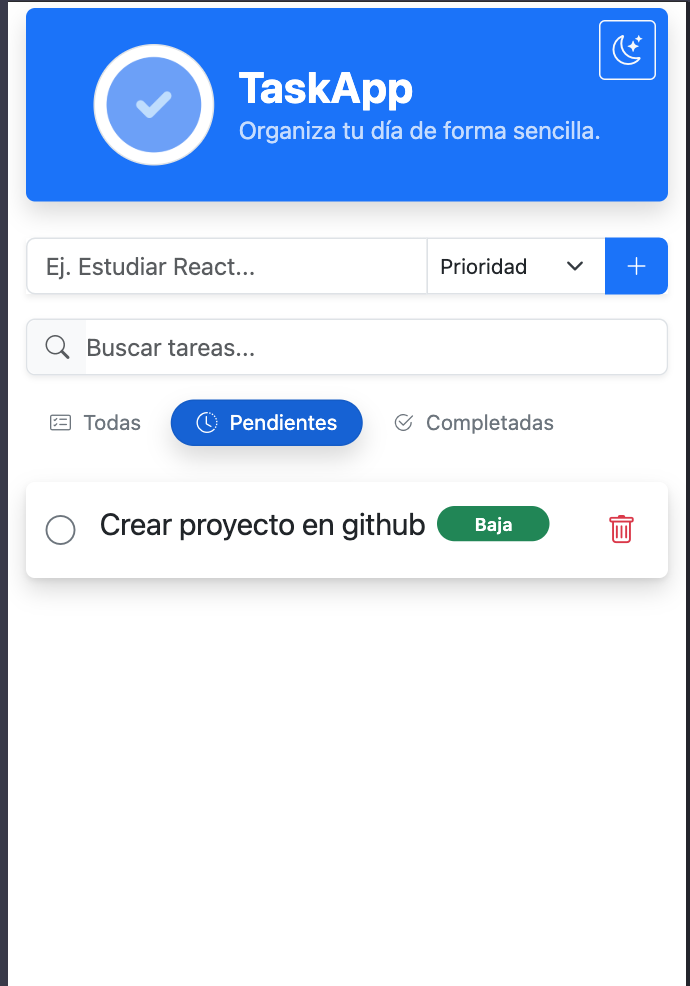
    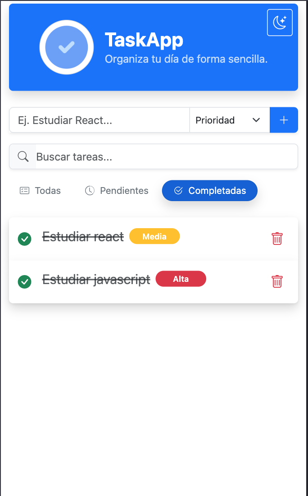
  </div>
</div>
<div>
  <h4>Dark Mode</h4>
  <div>
    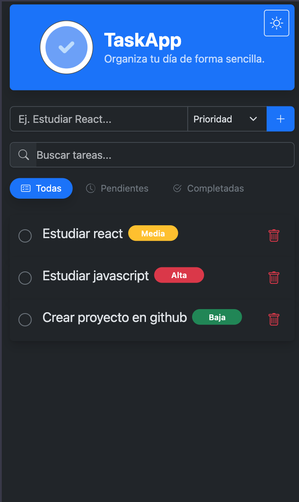 
    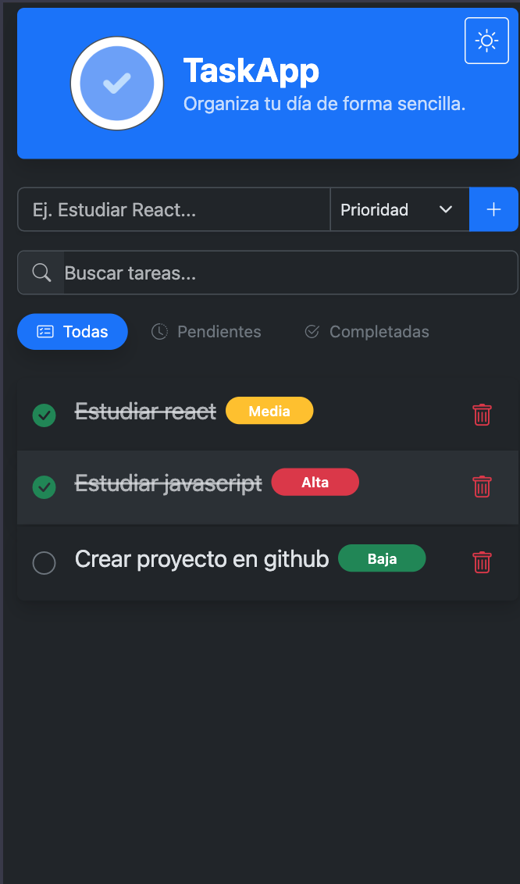
  </div>
  <div>
    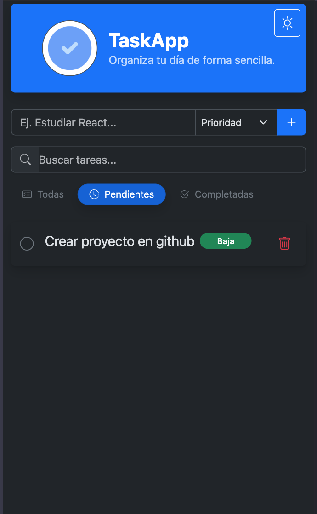
    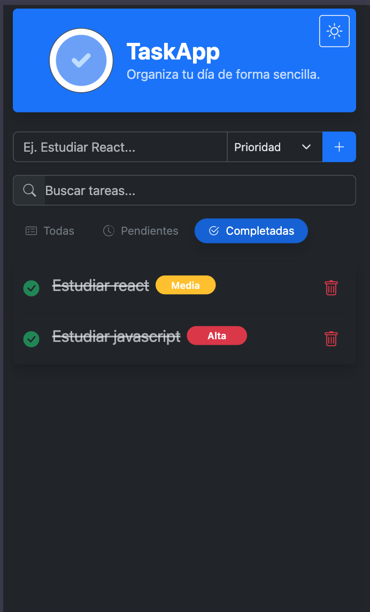
  </div>
</div>

### Vista Desktop

<div>
  <h4>Light Mode</h4>
  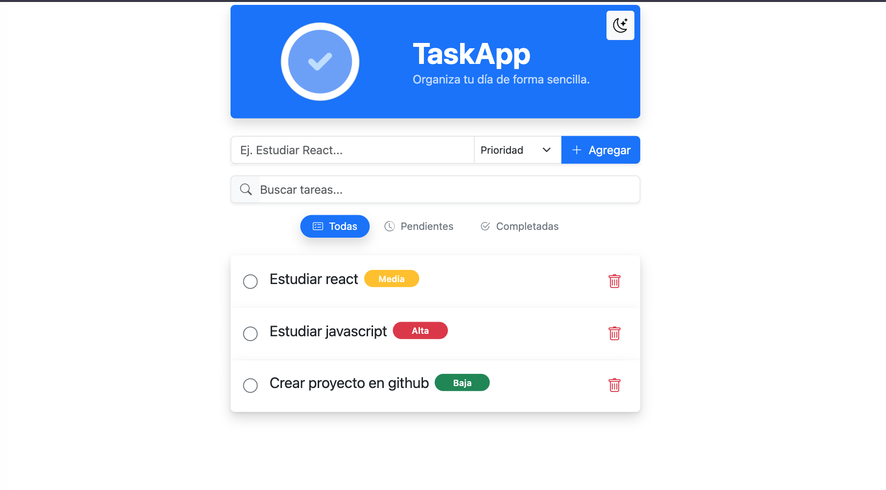
  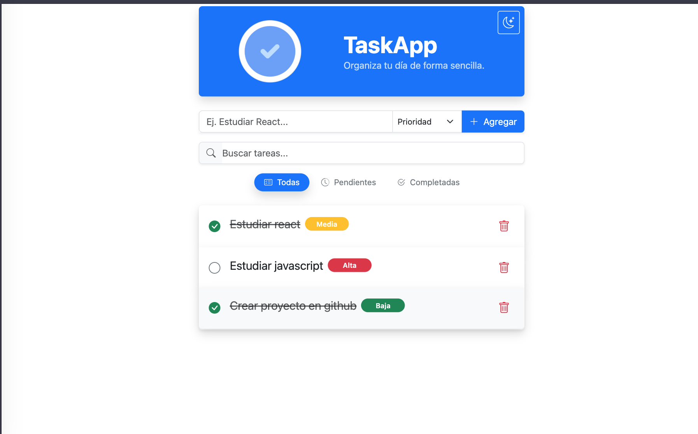
  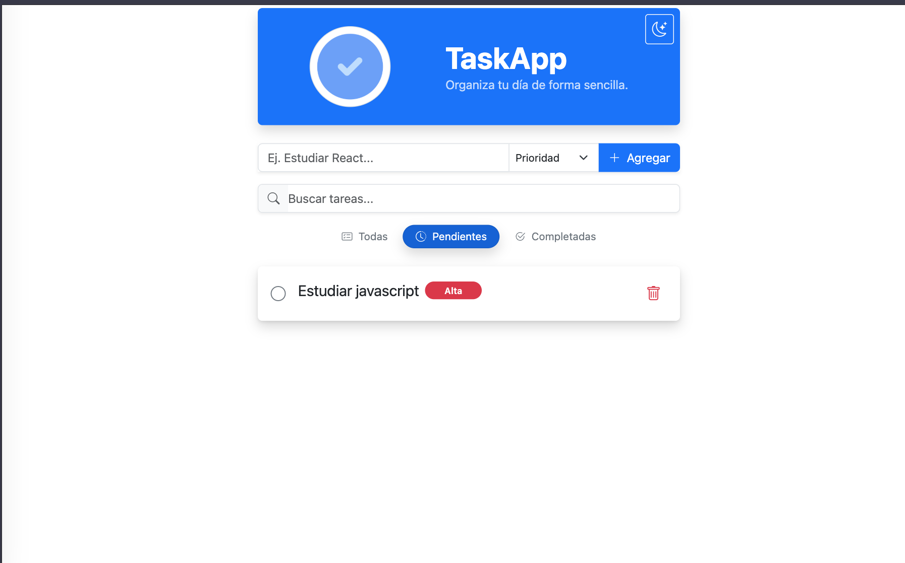
  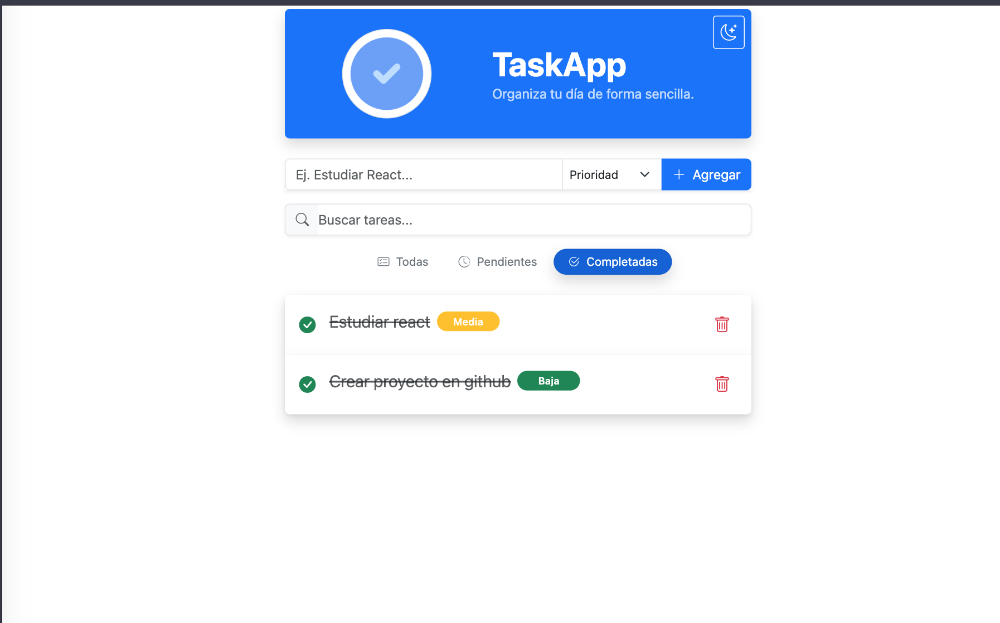
<div>
<div>
  <h4>Dark Mode</h4>
  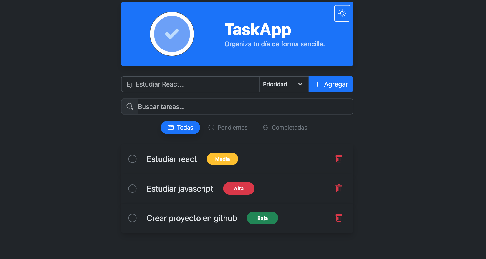
  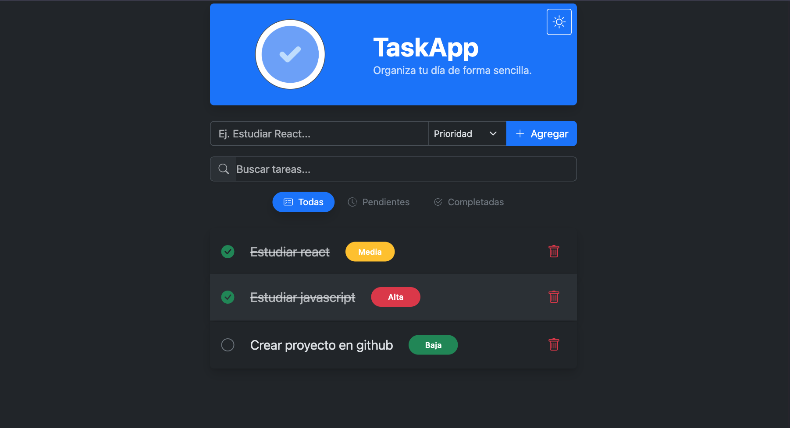
  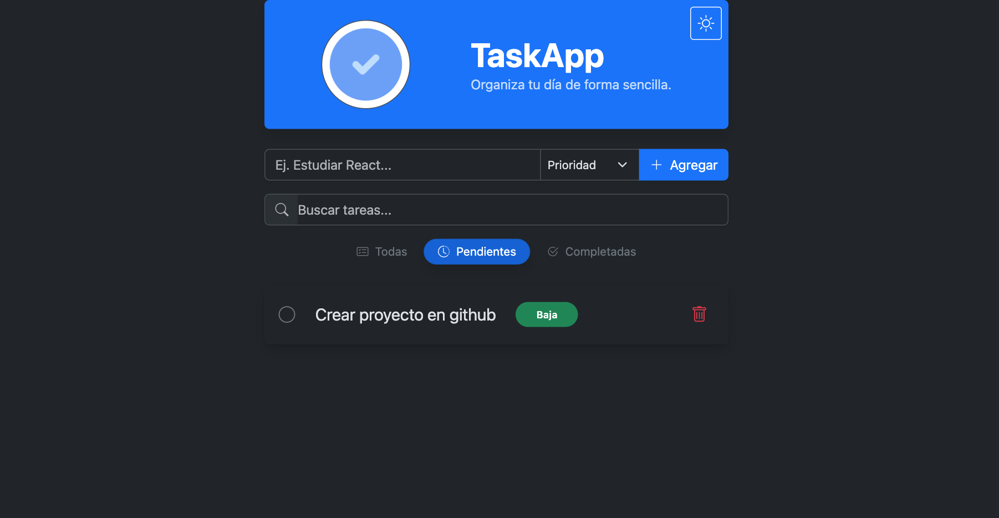
  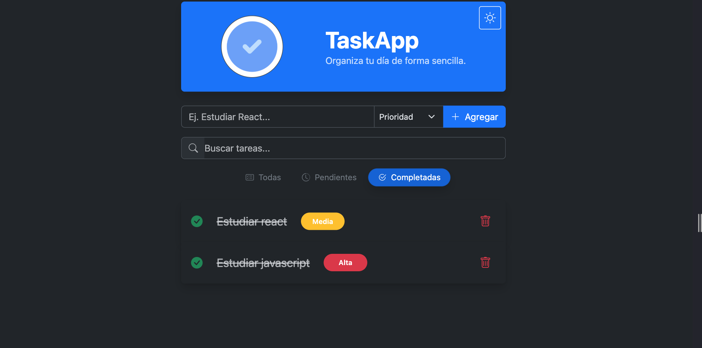
</div>

---

## 🎥 Demo en Vivo

[![Video]](https://github.com/user-attachments/assets/4aaee06f-6168-41f8-81f6-2c6af0eaba17)

> **Nota:** Se puede observar la fluidez de las animaciones al cargar tareas, marcarlas, cambiar entre tema claro u oscuro.

---

## 🌐 Despliegue y Demo

Para ver la aplicación en funcionamiento con todas las funcionalidades de persistencia y animaciones, puedes acceder al sitio oficial desplegado en Vercel:

[](https://task-app-alizunegas-projects.vercel.app/)

> **Nota:** La aplicación utiliza `localStorage`, por lo que tus datos se mantendrán guardados localmente en este navegador.

---

## 🤝 Autor

[Alicia Zuñega](https://github.com/ali-zunega)
Frontend Developer

---

## 📄 Licencia

This project is open-source and available under the [MIT License](./LICENSE).
